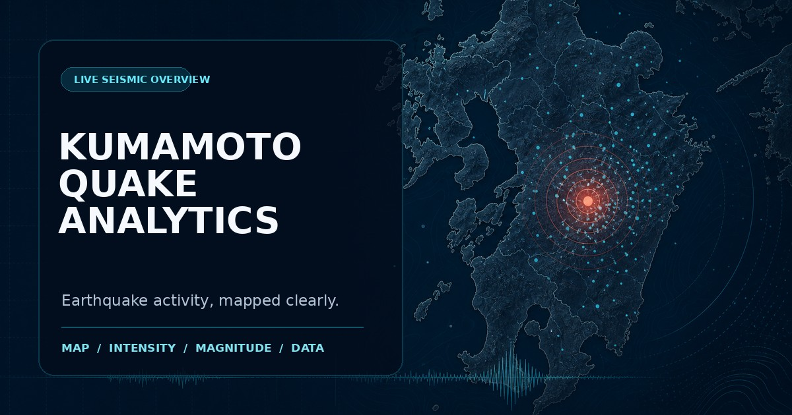

# 熊本県地震活動分析ダッシュボード

熊本県と日本全国の地震活動を、地図・震度・マグニチュード・地域別統計で確認できる静的 Web ダッシュボードです。気象庁の地震情報を中心に、震央が熊本県内の地震、熊本県内で揺れを観測した地震、日本全国の地震を切り替えて分析できます。

[ダッシュボードを開く](https://ericlin241.github.io/kumamoto-quake/)



> [!IMPORTANT]
> 本サイトは情報の可視化を目的とした非公式サービスです。防災行動の判断を代替するものではありません。緊急時は[気象庁](https://www.jma.go.jp/bosai/map.html?contents=earthquake_map&elem=int)や自治体など、公的機関の最新情報を確認してください。

## 主な機能

- 「熊本震源」「熊本有感」「日本全国」の3つの分析範囲
- 最小震度と震央名による絞り込み・検索
- 震央分布マップ（円の大きさでマグニチュード、色で最大震度を表現）
- 発生件数、最大マグニチュード、最大震度、平均震源深さの集計
- マグニチュードの時系列表示と震央別発生件数のグラフ
- 地震イベント一覧と観測データ表の連動
- 絞り込み結果の CSV エクスポート
- ライト／ダーク／システム連動テーマ
- Web Share API またはクリップボードによるページ共有
- PC・タブレット・スマートフォン向けレスポンシブ表示

## データについて

表示時は、まずリポジトリ内の `quake_cache.json` を読み込みます。取得できない場合は、P2P地震情報 API と気象庁連携 API を順にフォールバックとして利用します。静的データの `quake_data.js` は、ローカルファイルとして開いた場合にも使用されます。

GitHub Actions は30分ごとに `update_data.js` を実行し、気象庁の地震情報一覧を既存キャッシュと統合します。イベント ID で重複を除外し、新しい順に最大5,000件を `quake_cache.json` と `quake_data.js` に保存します。

データ提供元：

- [気象庁 防災情報（地震情報）](https://www.jma.go.jp/bosai/map.html?contents=earthquake_map&elem=int)
- [P2P地震情報](https://www.p2pquake.net/)

API や自動更新の状況により、表示内容が最新の発表と一致しない場合があります。

## ローカルで実行する

ビルド作業は不要です。リポジトリを取得し、任意の静的 HTTP サーバーで公開してください。

```bash
git clone https://github.com/ericlin241/kumamoto-quake.git
cd kumamoto-quake
python3 -m http.server 8000
```

ブラウザーで <http://localhost:8000> を開きます。

`index.html` を直接開くこともできますが、ブラウザーの制限により外部 API や一部機能が利用できない場合があります。

## データを手動更新する

Node.js 20 以降を用意し、次のコマンドを実行します。

```bash
node update_data.js
```

更新対象は次の2ファイルです。

- `quake_cache.json`：HTTP 経由で読み込む JSON キャッシュ
- `quake_data.js`：ローカル表示にも対応する JavaScript データ

同じ処理は GitHub Actions の「Update Earthquake Data」から手動実行することもできます。

## 使用技術

- HTML / CSS / Vanilla JavaScript
- [Leaflet](https://leafletjs.com/)（地図表示、リポジトリ内に同梱）
- [Chart.js](https://www.chartjs.org/)（グラフ表示、リポジトリ内に同梱）
- [CARTO Basemaps](https://carto.com/basemaps/)（背景地図）
- GitHub Pages / GitHub Actions

## ファイル構成

```text
.
├── .github/workflows/update_data.yml  # 地震データの定期更新
├── assets/                            # OGP・README 用画像
├── index.html                         # ページ構造とメタデータ
├── style.css                          # レイアウトとテーマ
├── app.js                             # データ処理と画面操作
├── update_data.js                     # 気象庁データの更新処理
├── quake_cache.json                   # 地震データの JSON キャッシュ
├── quake_data.js                      # ローカル表示用データ
├── leaflet.js / leaflet.css           # Leaflet
└── chart.js                           # Chart.js
```

## 免責事項

本リポジトリおよび公開サイトの情報について、正確性、完全性、即時性を保証するものではありません。地震・津波・避難に関する判断には、必ず公的機関が発表する情報を利用してください。
